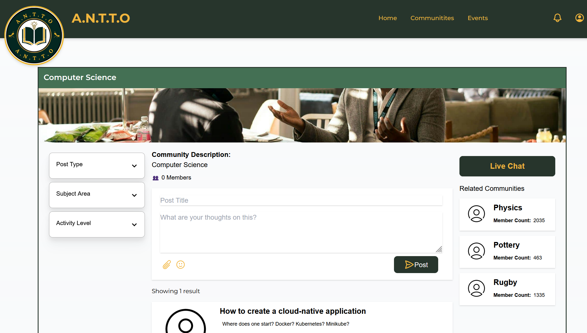

# 🐜 A.N.T.T.O

**A.N.T.T.O** is a cloud-native application designed as part of the COM3014 module coursework. Inspired by platforms like Reddit, A.N.T.T.O fosters education-focused communities, allowing users to join interest groups, create posts, leave comments, and organize events — all within a microservices-based architecture.

<p align="center">
  
  
</p>

## 🌟 Features

- 🧑‍🎓 **Education-focused Communities:** Users can join or explore communities based on subjects or academic interests.
- 📝 **Posting & Commenting:** Users can share ideas, ask questions, or provide insights.
- 📅 **Event Hosting:** Communities can organize and promote academic events.
- 🔐 **Authentication:** Secure login system for managing user identities.
- ⚙️ **API Gateway:** Central entry point that routes requests to appropriate microservices.

## 🧱 Tech Stack

| Layer | Technology |
|-|-|
| Frontend | React (`a.n.t.t.o/`) |
| API Gateway | Axum (`api-gateway/`) |
| Microservices | Django + Axum (`services/`) |
| Database | PostgreSQL / SQLite |
| Orchestration | Kubernetes (via Minikube) |
| Containerization | Docker |

## 🚀 Local Deployment using Minikube

### 📋 Prerequisites

Ensure you have the following installed:
- [Git](https://git-scm.com/)
- [Docker](https://docs.docker.com/)
- [Minikube](https://minikube.sigs.k8s.io/docs/)
- [Kubectl](https://kubernetes.io/docs/tasks/tools/)

### 📥 Clone and Deploy

In a Linux environment:

```bash
git clone https://github.com/Fedron/com3014.git
cd com3014
./infra/deploy_k8.sh
```

This script will:
- Start a local Minikube cluster
- Build all Docker images locally
- Install the A.N.T.T.O helm chart
- Run a Minikube tunnel to provide access to the application

### 🌐 Accessing the App

The script, run above, will print the URL that will allow access to the application.

### 🛠️ Troubleshooting

### Unable to run the deploy script

This is likely due to the script containing `CRLF` line endings when it was cloned - change the line endings to `LF` and run the script again.

#### Minikube - Start Host Failed

This can sometimes happen when you run the script when you already have an existing Minikube cluster - delete your existing Minikube cluster and run the script again.

#### Error from server (NotFound): services "{service_name}" not found

The frontend, API gateway, or one of the microservices has failed to start; to confirm run `kubectl get pods`. If any of the `antto` pods are not in a running state, re-run the deploy script to quickly restart the cluster.
